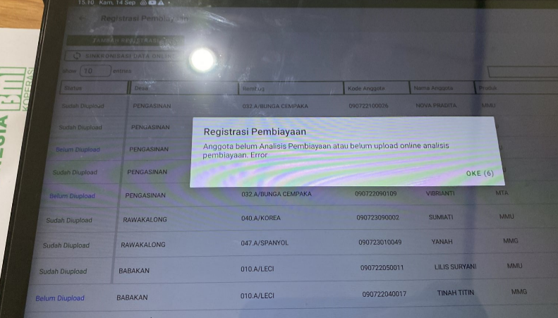

# Fitur Registrasi Pembiayaan (Last update (12/09/2023))
## Panduan Registrasi Pembiayaan
panduan video dapat diakses pada link berikut :
[Klik Disini untuk mengarahkan ke video panduan](https://drive.google.com/drive/folders/1fk09QpIVMg8Nq7Eo-Xqb_fMIs1R9DpmE?hl=id)

## Catatan Penting Fitur Registrasi Anggota
beberapa kasus dan pertanyaan yang sering ditanyakan sebagai berikut : 
### Kasus 1 : Registrasi Anggota dan Registrasi Pembiayaan dihari yang sama 

| No | Solusi | Rekomendasi
| ----------- | ----------- |---|
| 1 | untuk saat ini, bisa hubungi Tim IT agar nama anggota muncul di registrasi pembiayaan | ✅

### Kasus 2 : Gagal upload registrasi pembiayaan, karena belum AP, padahal sudah input AP

jika terdapat kendala seperti diatas, mohon untuk cek kembali antara **tanggal registrasi pada Registrasi Pembiayaan** dan **rencana plafon pada Analisis Pembiayaan**, karena untuk saat ini, penghubung antara registrasi pembiayaan dan ap berdasarkan hari yang sama.
jika terdapat perbedaan, lakukan perubahan di AP dan upload ulang kembali formulir AP
